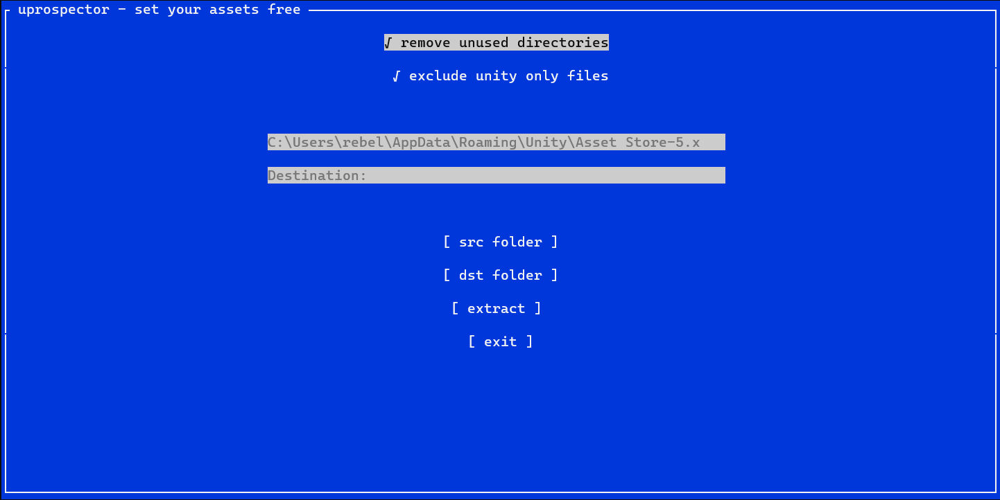

## uprospector
uprospector is a utility for extracting unitypackage files without unity. simply select the destination and source folder, all packages found in the source directory will be extracted to the destination in a folder named "extracted_packages".

## credits

The original inspiration for this code : https://github.com/Switch-9867/UnitypackgeExtractor